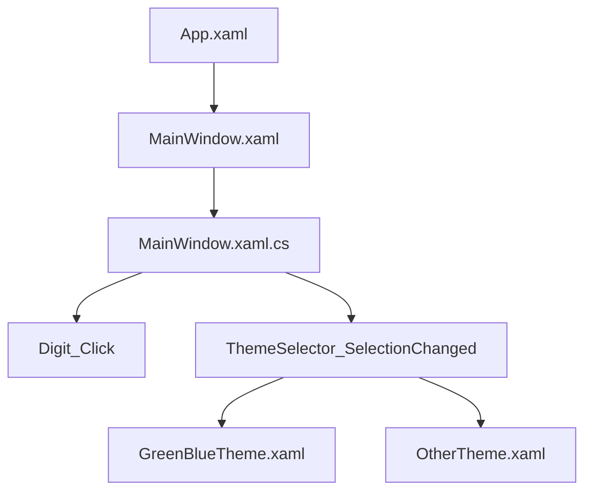

# Архитектура Calc

## Общая идея

Окно калькулятора описано в XAML. Логика ввода цифр и смены темы находится в code-behind.

## Схема



## Почему это не MVVM

Нет `ViewModel`, `DataContext`, `Binding` к ViewModel и `ICommand`. События кнопок напрямую вызывают методы окна.

## Главная особенность

Темы подключаются динамически:

```csharp
Application.Current.Resources.MergedDictionaries.Add(resourceDictionary);
```

