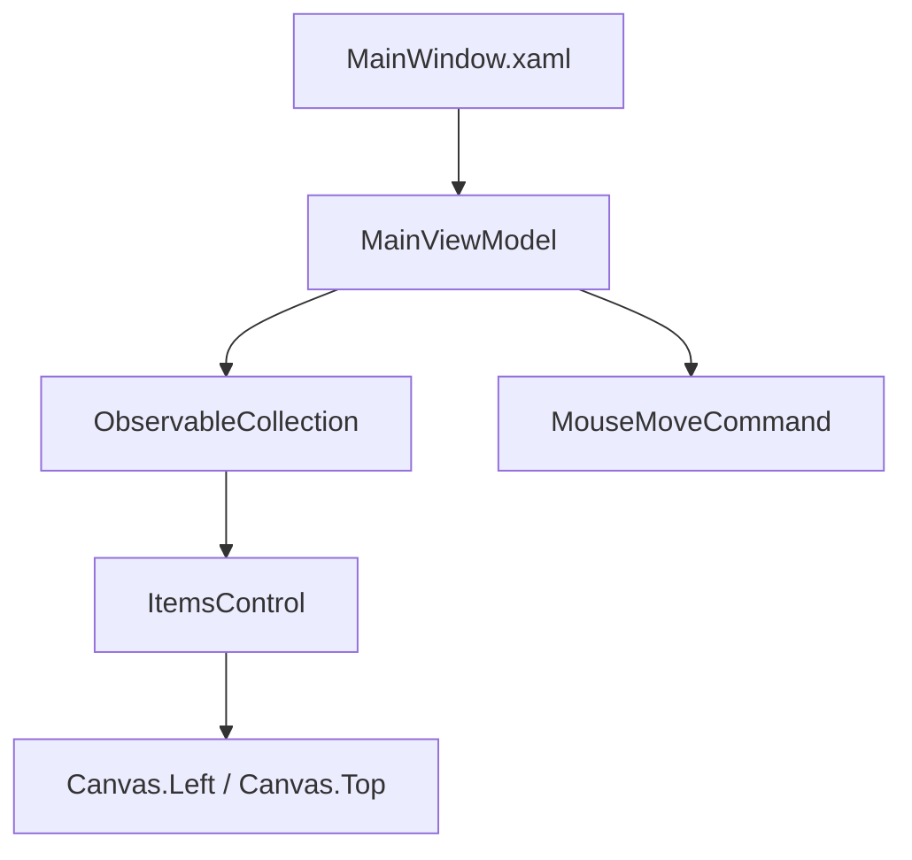

# Архитектура CanvasDrawing

## Общая идея

ViewModel хранит коллекцию точек, а View отображает эту коллекцию через `ItemsControl`.

## Схема

## Важная проблема

В ViewModel есть `MouseMoveCommand`, но в `MainWindow.xaml` не видно привязки события мыши к этой команде. Пакеты behaviors подключены, но XAML не использует `Interaction.Triggers`.

## Что важно для защиты

Нужно уметь объяснить задумку MVVM и честно отметить, что связка события мыши с командой выглядит незавершенной.

