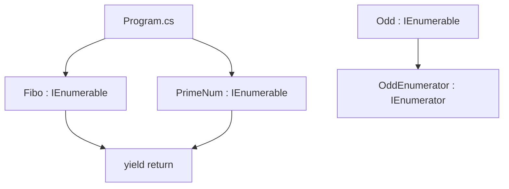

# Архитектура Enumarations

## Общая идея

Проект показывает два способа создать перечисляемую последовательность:

1. через `yield return`;
2. через отдельный класс, реализующий `IEnumerator<T>`.

## Схема связей



## Что делает `foreach`

Когда выполняется:

```csharp
foreach (var value in f)
```

C# вызывает:

```text
f.GetEnumerator()
→ MoveNext()
→ Current
```

## Почему `yield` упрощает код

В `Fibo` и `PrimeNum` не нужно писать `MoveNext`, `Current`, `Reset` и `Dispose`. Компилятор делает перечислитель сам.

В `OddEnumerator` этот механизм написан вручную, поэтому класс лучше показывает внутреннюю механику `foreach`.

## Чего нет в проекте

В проекте нет WPF, MVVM, базы данных, `async/await`, потоков и графического интерфейса.

