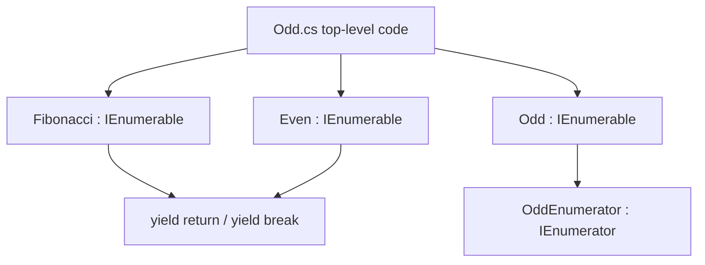

# Архитектура Enumerable

## Общая идея

Проект показывает два подхода к перечислению:

1. `yield return` — компилятор сам создает перечислитель.
2. Ручной `IEnumerator<T>` — перечислитель написан отдельным классом.

## Схема

## Повторный обход

`Fibonacci` и `Even` при каждом `foreach` получают новый перечислитель, потому что `yield` создает новое состояние обхода.

`Odd` возвращает одно поле `enumerator`, поэтому повторный обход зависит от состояния этого объекта.

## Чего нет в проекте

Нет WPF, MVVM, базы данных, `async/await`, потоков.

