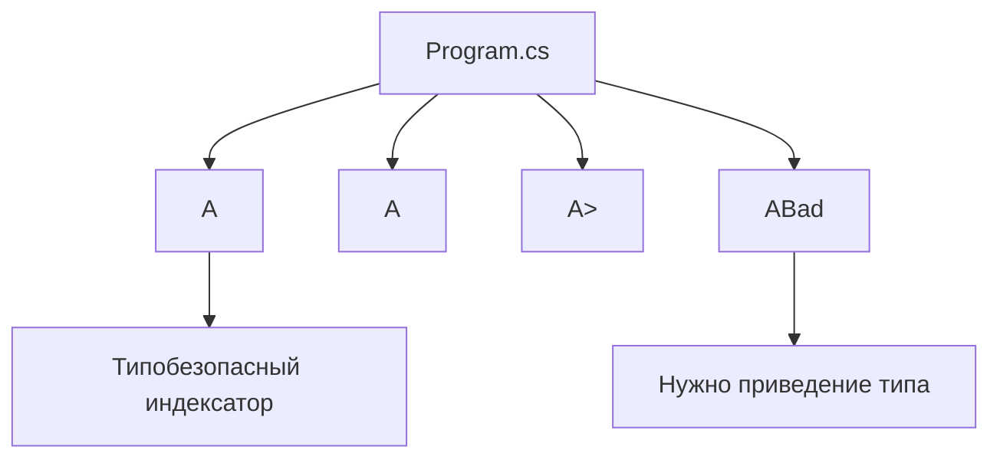

# Архитектура Generics

## Общая идея

Проект сравнивает два контейнера:

```text
A<T>    → хранит T[]      → возвращает T
ABad    → хранит object[] → возвращает object
```

## Схема



## Почему `A<T>` лучше

`A<T>` сохраняет тип элементов. Если создан `A<int>`, индексатор вернет `int`.

`ABad` теряет тип, потому что все элементы превращаются в `object`.

## Чего нет в проекте

Нет WPF, MVVM, базы данных, `async/await`, многопоточности.

