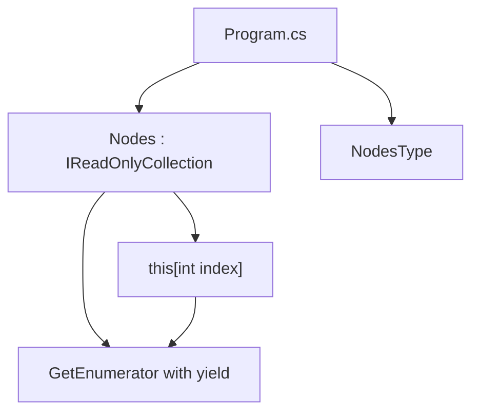

# Архитектура IEnum

## Общая идея

`Nodes` объединяет две формы доступа к данным:

- последовательный обход через `foreach`;
- доступ по индексу через `this[int index]`.

## Схема

## Роль `NodesType`

`NodesType` должен выбирать способ построения узлов: равномерные, Чебышева или случайные. В текущем коде реально реализован только `Equidistant`.

## Чего нет в проекте

Нет WPF, MVVM, БД, `async/await`, потоков.

