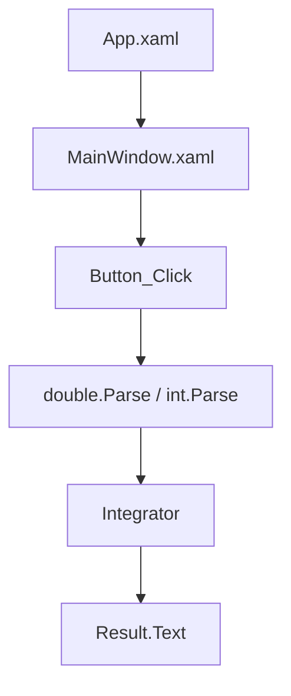

# Архитектура Integr

## Общая идея

Проект делит код на две части:

- интерфейс и обработчики WPF: `MainWindow.xaml`, `MainWindow.xaml.cs`;
- вычислительная логика: `Integrator.cs`.

## Схема

## Почему это не MVVM

В проекте нет:

- `ViewModel`;
- `DataContext`;
- `Binding` к свойствам ViewModel;
- `ICommand`.

Кнопка вызывает обработчик `Button_Click` напрямую.

## Что важно для защиты

Нужно уметь объяснить разницу между WPF с code-behind и WPF с MVVM. Здесь логика реакции на кнопку находится в `MainWindow.xaml.cs`, а не в команде ViewModel.

