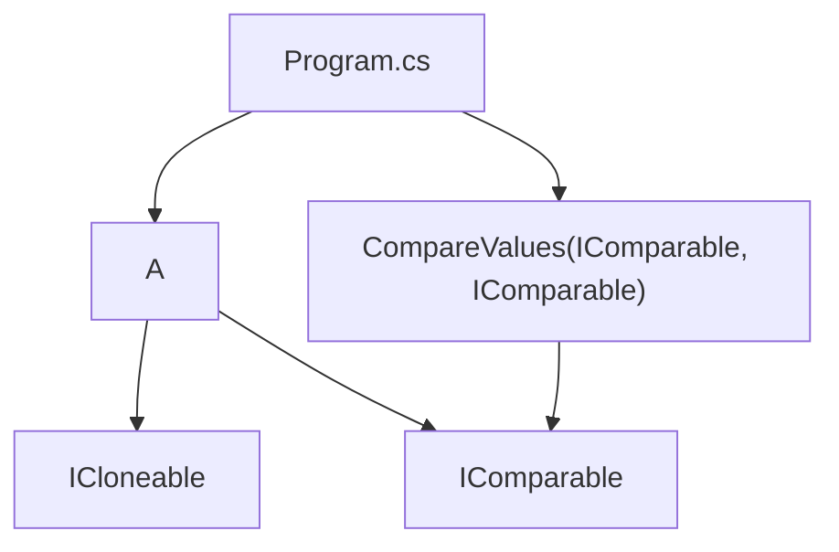

# Архитектура Interface

## Общая идея

Проект показывает, как класс `A` реализует два стандартных интерфейса:

- `ICloneable` — объект можно клонировать;
- `IComparable` — объект можно сравнивать.

## Схема связей

## Почему это важно

Интерфейс задает не наследование реализации, а обязательство: класс обещает, что у него есть нужный метод.

`CompareValues` не знает деталей класса `A`, но может вызвать `CompareTo`, потому что параметр имеет тип `IComparable`.

## Чего нет в проекте

Нет WPF, MVVM, БД, `async/await`, потоков.

