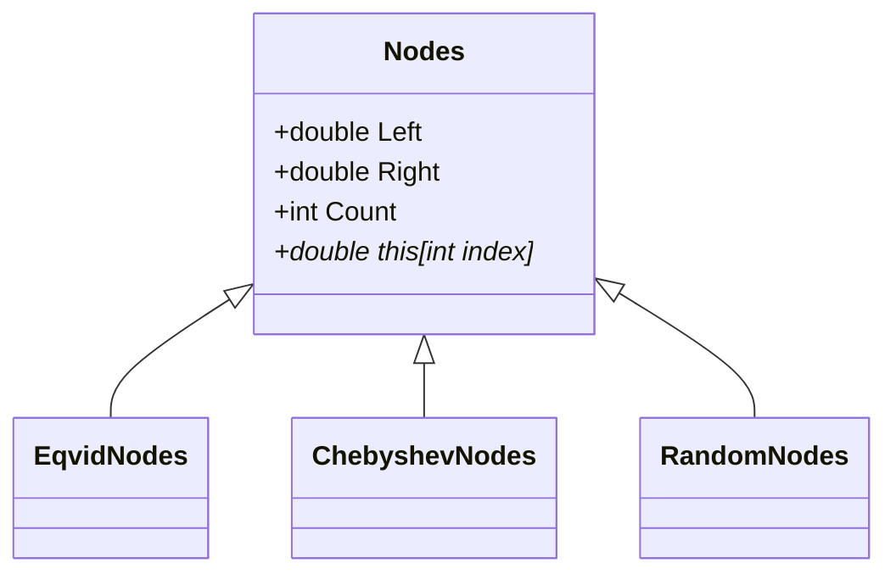

# Архитектура Lection-Abstract

## Общая идея

Проект использует наследование: общий код и общие свойства находятся в базовом классе `Nodes`, а конкретное вычисление узлов находится в наследниках.

## Схема наследования



## Почему `Nodes` абстрактный

Сам `Nodes` не знает, по какой формуле возвращать узел. Поэтому индексатор объявлен абстрактным:

```csharp
public abstract double this[int index] { get; }
```

Каждый наследник обязан реализовать этот индексатор.

## Полиморфизм

Все наследники являются разновидностями `Nodes`. Их можно воспринимать как объекты одного общего типа, но при обращении к индексатору будет работать реализация конкретного наследника.

## Чего нет в проекте

Нет WPF, MVVM, БД, `async/await`, потоков.

