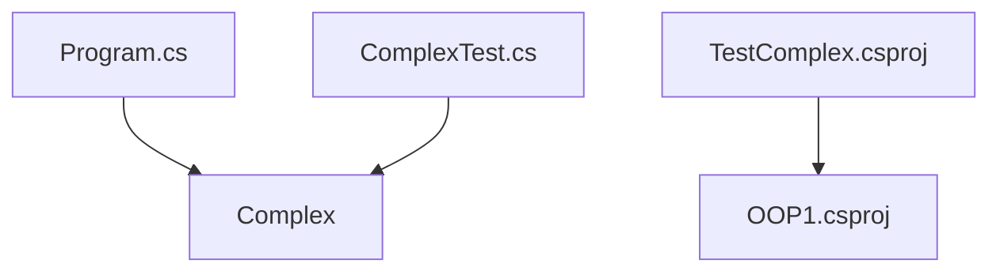

# Архитектура OOP1

## Общая идея

Проект построен вокруг одного класса — [[Класс — Complex]]. Этот класс представляет комплексное число и инкапсулирует работу с его действительной и мнимой частями.

## Слои

Формальных слоев в проекте нет. Это учебное консольное приложение.

Условно можно выделить:

- модель: `Complex`;
- демонстрационный код: закомментированный код в `Program.cs`;
- тесты: `ComplexTest`.

## Почему это не MVVM

В проекте нет:

- графического интерфейса;
- XAML;
- `View`;
- `ViewModel`;
- `DataContext`;
- `ICommand`.

Поэтому проект не относится к WPF/MVVM. Он нужен для базовых тем ООП.

## Связи между частями

## Объектная модель

`Complex` содержит состояние:

- `_re`;
- `_im`.

И поведение:

- вычисление модуля `Abs`;
- строковое представление `ToString`;
- сложение через `Plus` и `operator +`;
- вычитание через `operator -`;
- сравнение через `==`, `!=`, `Equals`;
- доступ к частям через индексатор `this[string part]`.

## Что важно для защиты

Нужно объяснить, что проект показывает не просто набор функций, а объектную модель: данные комплексного числа и операции над ним собраны в одном классе.

Это пример инкапсуляции: внутренние поля скрыты, а доступ к ним организован через свойства.

