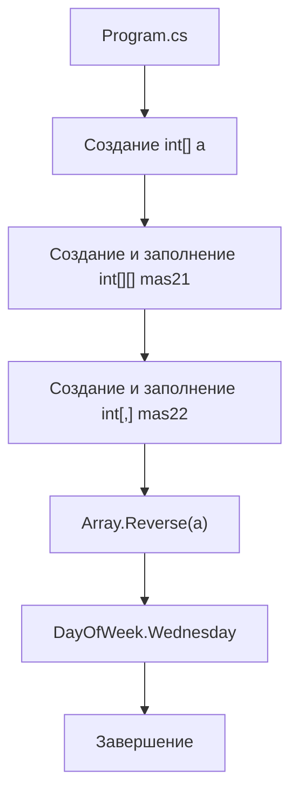

# Архитектура OOP5

## Общая идея

`OOP5` — не архитектурный проект, а лекционный пример. Весь код расположен в `Program.cs` и выполняется сверху вниз.

## Что есть в проекте

- top-level statements;
- несколько массивов;
- вложенные циклы;
- перечисление `DayOfWeek`.

## Чего нет в проекте

В проекте нет:

- пользовательских классов с состоянием и методами;
- наследования;
- интерфейсов;
- WPF;
- MVVM;
- базы данных;
- `async/await`;
- многопоточности.

## Схема выполнения

## Почему это важно для экзамена

Работа с массивами вынесена в отдельную экзаменационную тему. Этот проект показывает сразу три формы массивов:

- одномерный;
- зубчатый;
- двумерный.

Также проект показывает перечисление с флагами, что помогает объяснять, как `enum` может использоваться не только как набор именованных констант, но и как набор битовых признаков.

