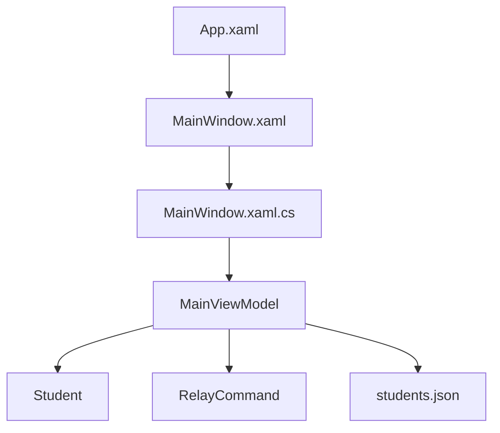

# Архитектура Students

## Общая идея

Проект близок к MVVM:

- View: `MainWindow.xaml`;
- ViewModel: `MainViewModel`;
- Model: `Student`;
- Command: `RelayCommand`.

## Схема



## Data Binding

Список студентов:

```xml
ItemsSource="{Binding Students}"
SelectedItem="{Binding SelectedStudent}"
```

Редактирование выбранного студента:

```xml
DataContext="{Binding SelectedStudent}"
Text="{Binding LastName}"
```

Команды:

```xml
Command="{Binding AddButtonPress}"
```

## Что делает code-behind

`MainWindow.xaml.cs` создает ViewModel, назначает `DataContext` и вызывает `SaveOnExit` при закрытии окна.

