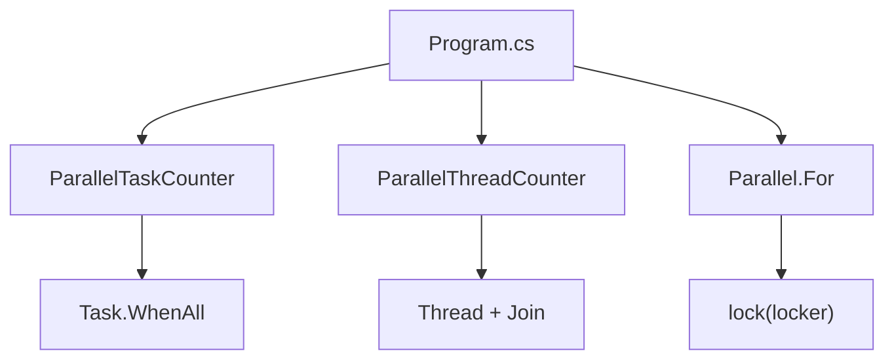

# Архитектура Tasks

## Общая идея

Одна задача решается несколькими способами: посчитать простые числа от `0` до `1_000_000`.

## Схема

## Где есть синхронизация

- `ParallelThreadCounter` использует `lock (this)` при добавлении локального результата.
- `Parallel.For` использует `lock (locker)` при увеличении общего `result`.
- `ParallelTaskCounter` избегает общего счетчика: каждая задача возвращает `int`, а результаты суммируются после `Task.WhenAll`.

