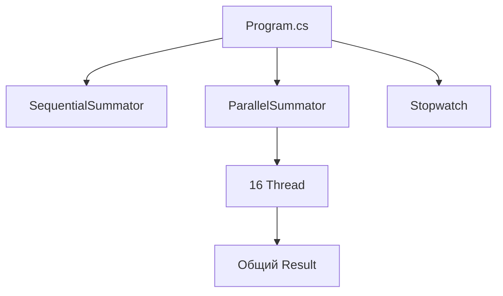

# Архитектура Threads1

## Общая идея

Проект сравнивает два подхода к одной задаче:

```text
SequentialSummator → один цикл в одном потоке
ParallelSummator   → 16 потоков, каждый считает свою часть
```

## Схема



## Где проблема синхронизации

В `ParallelSummator` несколько потоков выполняют:

```csharp
Result += i;
```

Это изменение общего состояния без `lock`. Из-за этого результат может быть нестабильным.

## Чего нет в проекте

Нет `Task`, `async/await`, WPF, MVVM и базы данных.

